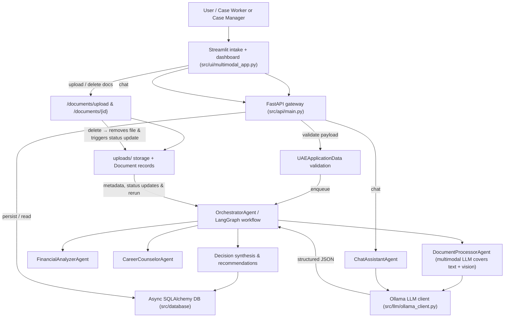

# UAE Social Support AI System

An agentic, multimodal reference implementation for evaluating social-support applications in the United Arab Emirates. The project combines a FastAPI backend, a Streamlit control panel, reusable LangGraph workflows, and Ollama-powered reasoning agents operating over realistic (synthetic) applicant data.

## Table of Contents
- [Architecture Overview](#architecture-overview)
- [Repository Layout](#repository-layout)
- [Prerequisites](#prerequisites)
- [Quick Start](#quick-start)
- [Command Reference](#command-reference)
- [Configuration](#configuration)
- [API and UI Highlights](#api-and-ui-highlights)
- [Agents and Workflows](#agents-and-workflows)
- [Data Assets](#data-assets)
- [Development Tips](#development-tips)

## Architecture Overview

```
                        ┌──────────────────────┐
                        │        Streamlit     │
                        │  Multimodal UI       │
                        └─────────┬────────────┘
                                  │ REST
                        ┌──────────▼───────────┐
                        │      FastAPI         │
                        │  (src/api/main.py)   │
                        └──────────┬───────────┘
                                  │ async calls
                        ┌──────────▼───────────┐
                        │  OrchestratorAgent   │
                        │                      │
                        └──────────┬───────────┘
                     ┌─────────────▼──────────────┐
                     │ Document / Financial /      │
                     │ Career / Chat Agents        │
                     │ (LLM-first with fallbacks)  │
                     └─────────────┬──────────────┘
                                  │
                    ┌────────────▼────────────┐
                    │   Ollama LLM Client     │
                    │ async bridge & retries  │
                    └────────────┬────────────┘
                                 │
                    ┌────────────▼────────────┐
                    │ Async SQLAlchemy DB     │
                    │ (SQLite by default)     │
                    └─────────────────────────┘
```

### Detailed Workflow



## Repository Layout

```
├── run.py                   # CLI entry point (api, ui, demo, setup)
├── requirements.txt         # Python dependencies
├── data/                    # Synthetic application datasets
├── logs/, exports/, uploads/ # Runtime artifacts
├── src/
│   ├── api/                 # FastAPI application
│   ├── agents/              # Decision-making agents
│   ├── orchestration/       # LangGraph workflow
│   ├── models/              # Pydantic models for UAE context
│   ├── config/              # Settings & environment integration
│   ├── database/            # Async SQLAlchemy models & session manager
│   ├── llm/                 # Ollama Cloud client wrapper
│   └── ui/                  # Streamlit dashboard
└── scripts/                 # Legacy utilities (data loader, etc.)
```

## Prerequisites
- Python 3.10+
- [Poetry](https://python-poetry.org/) or `pip` for dependency management
- Optional: Docker & docker-compose (for containerized deployment)
- Optional: Access to [Ollama Cloud](https://ollama.com) or a compatible API, configured via `OLLAMA_API_KEY`
- Optional: PostgreSQL & Redis instances if you want to swap the default SQLite database

## Quick Start

```bash
python -m venv .venv
source .venv/bin/activate  # or .venv\Scripts\activate on Windows
pip install -r requirements.txt
# Copy the environment template
cp .env.example .env

# Populate .env with secrets (e.g., OLLAMA_API_KEY) and any overrides

# Start the FastAPI backend
python run.py api

# In a second shell, launch the Streamlit control panel
python run.py ui

Alternatively, run both services with a single command:

```bash
python run.py serve
```

The first `api` run bootstraps the async database defined in `DATABASE_URL` (defaults to `social_support.db` in the project root). Visit the UI at <http://localhost:8501>. The UI communicates with the API (default `http://0.0.0.0:8005`) for application submission, analytics, real-time chat, and persistence.

Run a scripted demonstration:

```bash
python run.py demo
```

The demo loads **10** synthetic applications (see `data/synthetic_applicants.json`), submits each through the agent pipeline, prints the resulting decisions, **and persists every run in the SQLite database** so you can immediately inspect the results in the UI/API afterwards. The command now attempts to use an asyncio event loop when the host supports it; if the environment blocks loop creation (common in some restricted containers), it transparently falls back to the synchronous runner to avoid "no running event loop" errors.

## Command Reference

`run.py` exposes four subcommands:

| Command | Description |
|---------|-------------|
| `api`   | Launches the FastAPI service (`uvicorn`), exposing `/`, `/applications/submit`, `/chat`, `/stats`, `/chat/health`, and additional endpoints. |
| `ui`    | Runs the Streamlit interface from `src/ui/multimodal_app.py`. |
| `demo`  | Executes an async demonstration that feeds sample data through the orchestrator (in-memory; results are not saved). |
| `serve` | Launches both the FastAPI service (`uvicorn`) and Streamlit interface in one command. |
| `setup` | Calls `setup_uae_system.py` (if present) to initialize data directories, exports, and verification reports. |

## Configuration

Environment variables are loaded via `python-dotenv`. Define them in a `.env` file at the project root. Common settings:

1. Copy the provided template: `cp .env.example .env`.
2. Edit `.env` to add any secrets (e.g., `OLLAMA_API_KEY`) and override defaults (database URLs, Redis, etc.). Do **not** commit the populated `.env` file.
3. Defaults also live in `src/config/settings.py`; environment values take precedence.

## API and UI Highlights
- **FastAPI (src/api/main.py)**
  - Root endpoint returns build status and feature flags.
  - `/applications/submit` hands payloads to the LangGraph workflow or orchestrator agents, persists the results in SQLite/PostgreSQL, and returns eligibility decisions.
  - `/applications/{id}` reads the stored decision bundle for any submission.
  - `/chat` enables conversational guidance, stores the chat transcript, and falls back to curated UAE-specific answers when the LLM is unreachable.
  - `/chat/health` reports health for the LLM client, LangGraph, and chat agent.
  - `/documents/upload` accepts multipart document uploads, stores them, and updates the linked application status + timestamp; `/documents/{document_id}` can remove a stored upload if it was sent in error and ensures the owning application is flagged for another document pass; `/applications/{id}/documents` exposes the stored uploads for downstream tooling.
  - `/stats` aggregates database-backed metrics for the dashboard.
- **Streamlit UI (src/ui/multimodal_app.py)**
  - Dashboard: key metrics plus recent activity snapshots.
  - Application wizard: guides users through personal, family, employment, and support-request details before calling the API.
  - Document uploads: once the intake is complete you can drop in Emirates ID, bank statements, salary certificates, etc., before submitting, and an additional “Upload Documents” page lets case workers select an existing application and add missing papers. Each page now lets you delete mis-uploaded files before submitting, and every successful upload auto-triggers the orchestrator so the document validation stage (with the multimodal LLM) sees the newest assets.
  - Chat assistant: live Q&A backed by the reliable chat agent.
  - Analytics: pandas/Plotly views over synthetic data.
  - System status: checks the health of backend services and LLM integrations.

## Agents and Workflow Flow

The FastAPI backend orchestrates a multi-agent pipeline that is LLM-powered when Ollama credentials are provided:

1. **OrchestratorAgent (`src/agents/orchestrator_agent.py`)**
   - Entry point for application processing.
   - Sequencing: document validation ➜ financial analysis ➜ career enablement ➜ decision synthesis.
   - Persists intermediate outputs so the API can return detailed stage-level results.

2. **Domain Agents**
   - **DocumentProcessorAgent** inspects Emirates ID, salary certificates, and financial statements. When the Ollama client is available it produces structured authenticity scores; otherwise it falls back to rule-based heuristics.
     - The agent now extracts PDF text first, flags scanned uploads, and sends the assets through a multimodal LLM prompt so even imperfect scans are interpreted; each uploaded document also advances the application status/timestamp so “documents required” cases stay visible.
     - Uploading a document through the UI persists it via `/documents/upload`, immediately re-enqueues `OrchestratorAgent.process`, and the refreshed `DocumentProcessorAgent` packages both any new text snippets and the document image paths (passed into Ollama via the `images` payload) so structured authenticity/confidence fields feed into the workflow before the financial and career agents run.
   - **FinancialAnalyzerAgent** generates eligibility scores, risk factors, and recommended support amounts using the LLM, while retaining deterministic logic for offline mode.
   - **CareerCounselorAgent** recommends training programmes, job opportunities, and timelines. LLM insights enrich the static UAE playbooks when online.
   - **ChatAssistantAgent** powers `/chat` directly. Responses are composed by the LLM with intent classification and suggested follow-up actions; a curated fallback remains for resiliency.

3. **LLM Client (`src/llm/ollama_client.py`)**
   - Async wrapper around the Ollama SDK with automatic retries, JSON parsing, and an `_acall` compatibility helper for older integrations.
   - Exported as `ollama_llm` and `llm_client` so all agents share the same connection state.

4. **Optional LangGraph Workflow (`src/orchestration/langgraph_workflow.py`)**
   - Mirrors the orchestrator pipeline with LangGraph StateGraph semantics, enabling checkpointing or experimentation with the fully LLM-driven agents in `src/agents/llm_powered_agents.py`.
   - The FastAPI service prefers this path when `langgraph` is installed and configured.

The pipeline is designed to degrade gracefully: each agent first attempts an LLM call and only executes its deterministic fallback if the client is unavailable. Chat traffic follows the same pattern, ensuring the system remains operational even without external connectivity.

## Data Assets

The repository ships with synthetic UAE-specific datasets under `data/`:

- `applications.json` / `applications_summary.csv` – 150 applicant records across emirates.
- `case_workers.json`, `training_programs.json` – complementary program data.
- `analytics.json` – nine months of aggregate metrics.
- `faq.json` – multilingual FAQ entries for the chat assistant.

`scripts/data_loader.py` and `scripts/ai_processor.py` demonstrate how to consume these files outside the live API.

## Development Tips
- Use `python run.py api` with `reload=False` (default) for predictable agent initialization.
- The UI expects the API to be reachable at `API_HOST:API_PORT`; adjust `.env` if deploying remotely.
- Logging goes to stdout and `logs/`—helpful when inspecting agent decisions or LLM fallbacks.
- To experiment with the LangGraph workflow, import `workflow_orchestrator` from `src/orchestration/langgraph_workflow.py` and feed it application states directly.
- Keep `requirements.txt` synced with any new agent dependencies; pre-commit hooks are not bundled by default.

---

For questions or suggested improvements, open an issue or start a discussion in this repository.
