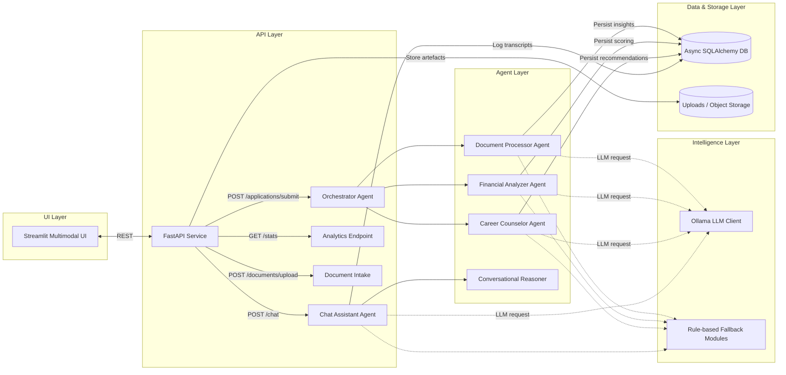
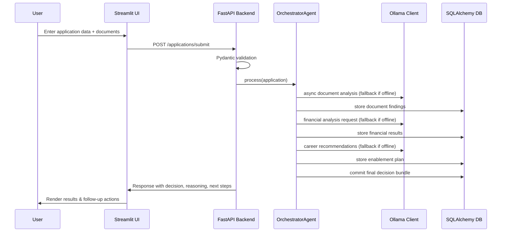

# UAE Social Support AI System – Comprehensive Solution Summary

*Version 1.2 — Prepared for architecture and engineering stakeholders (≤ 10 pages in print-ready format).*  
This document captures the overall design, rationale, and roadmap for the UAE Social Support AI System. It focuses on how the platform adjudicates social-support applications in a modular, explainable, and integration-ready manner.

---

## 1. Executive Summary

The UAE Social Support AI System is a production-ready reference platform that combines deterministic business logic with large language model (LLM) intelligence. Applicants interact through a multimodal Streamlit experience that connects to a FastAPI backend. The backend orchestrates a suite of agents—document verification, financial analysis, career counseling, and conversational support—each of which uses the shared Ollama LLM client when available and falls back to rule-based heuristics when connectivity or GPU resources are constrained. Decisions, intermediate artifacts, and chat transcripts persist in an async SQLAlchemy data layer, ensuring traceability and auditability. The architecture prioritises modularity, resilience to LLM outages, and compatibility with existing government ecosystems.

---

## 2. Solution Architecture & Data Flow

### 2.1 Component Map

### 2.2 Data Flow Narrative

1. **Submission**: An applicant or case worker enters details and uploads documents via Streamlit, which calls FastAPI endpoints over HTTPS.
2. **Validation**: FastAPI uses Pydantic models to validate the payload. Errors are surfaced back to the UI with field-level hints.
3. **Orchestration**: Valid requests pass to the `OrchestratorAgent`, which triggers sequential domain agents.
4. **Intelligence**: Each agent attempts to leverage the Ollama LLM client for nuanced scoring. If the client is unavailable or in offline mode without GPU support, rule-based fallbacks ensure continuity.
5. **Persistence**: Outcomes (scores, decisions, timelines) are stored in the async database. Uploaded documents are saved to disk/object storage.
6. **Response**: Final decisions, recommendations, and metrics return to the UI. Chat interactions follow a similar loop, storing transcripts for audit trails.

### 2.3 Sequence Overview

---

## 3. Tooling & Technology Rationale

### 3.1 Backend & API

- **FastAPI** was chosen for its async-first design, type hints, and automatic OpenAPI generation. It runs efficiently under Uvicorn/Gunicorn and scales horizontally behind load balancers. Dependency injection (e.g., for database sessions) simplifies testing and maintainability.
- **Pydantic** models enforce domain-specific rules (Emirates ID format, phone numbers, income ranges) and provide readable error messages. This reduces accidental data quality issues and shields downstream logic from malformed payloads.

### 3.2 UI & Presentation

- **Streamlit** accelerates internal dashboard development. It reuses Python domain models, enabling analysts and case workers to iterate quickly without separate frontend stacks. Streamlit is container-friendly and integrates with corporate authentication if required.

### 3.3 Data & Persistence

- **SQLAlchemy (async)** offers a vendor-neutral ORM with strong typing. The default SQLite implementation is lightweight for prototyping, while production deployments can switch to PostgreSQL with connection pooling and replication support.
- **Uploads** currently leverage the local filesystem; the interface is compatible with S3/Azure Blob connectors, enabling secure object storage in production.

### 3.4 Intelligence Layer

- **Ollama LLM Client** centralises connectivity to LLM providers, supporting both online (cloud-hosted GPU) and offline (on-prem GPU) modes. Its structured-response helper reduces parsing errors and simplifies future model swaps.
- **Rule-Based Modules** act as resilient fallbacks, ensuring the core adjudication pipeline remains operational even when LLM calls fail or resources are constrained.

### 3.5 Workflow Orchestration

- **LangGraph (Optional)** maps agent interactions into graph-based workflows. It enables sophisticated experimentation, branching, and checkpointing without altering baseline agent code. When LangGraph is absent, the orchestrator falls back to the native async pipeline.

### 3.6 Operational Merit

| Evaluation Lens | Notes |
|------------------|-------|
| **Suitability** | Components are popular, well-supported, and align with existing Python skillsets across many data teams. |
| **Scalability** | Async I/O, horizontal scaling via containers, and optional distributed orchestration (LangGraph) ensure performance under higher loads. |
| **Maintainability** | Modular agents and shared utility layers reduce code duplication. Clear boundaries allow independent updates (e.g., swap financial scoring logic without affecting chat). |
| **Performance** | LLM calls are async with retry and backoff; deterministic fallbacks guarantee bounded response times. SQLAlchemy caching options and read replicas can handle traffic spikes. |
| **Security** | Input validation, planned OAuth2 integration, logging, and the ability to encrypt PII at rest lay a strong foundation for compliance with UAE regulations. |

---

## 4. Modular AI Workflow Breakdown

### 4.1 API Gateway
- Endpoints include `/applications/submit`, `/applications/{id}`, `/documents/upload`, `/chat`, `/stats`, and `/debug/system`.
- Handles validation, orchestrator invocation, and persistence while exposing health/diagnostics endpoints for observability.

### 4.2 Orchestrator Agent
- Serves as the primary controller of the eligibility workflow.
- Maintains a processing timeline, logs, and stage outputs so case workers can trace decisions end-to-end.

### 4.3 Document Processor Agent
- Extracts Emirates ID details, salary evidence, and bank statement metrics.
- Baseline heuristics check formatting and completeness; the LLM version enhances authenticity scoring and anomaly detection.

### 4.4 Financial Analyzer Agent
- Evaluates monthly income versus emirate thresholds, employment stability, family burden, and requested support amounts.
- Combines deterministic scoring with LLM reasoning to produce eligibility scores, recommended disbursements, and risk factors.

### 4.5 Career Counselor Agent
- Recommends training programs and job opportunities tailored to the applicant’s emirate and experience.
- Integrates static UAE datasets with dynamic LLM insights to suggest timelines and success metrics.

### 4.6 Chat Assistant Agent
- Processes natural language inquiries from applicants. Utilises LLM intents when available and rule-based responses otherwise.
- Persists conversation history for audit and customer support.

### 4.7 Persistence & Logging
- `Application`, `Document`, `ChatSession`, and `ProcessingLog` tables capture comprehensive records.
- Logging is centralised, with structured messages for ingestion by ELK/Splunk stacks.

### 4.8 Extensibility
- Additional agents (e.g., fraud detection, benefits optimisation) can plug into the orchestrator by following the same interface contracts.

---

## 5. Data, Pipeline, and Governance Considerations

### 5.1 Data Management
- **Source of Truth**: The async database stores the canonical state, including raw submissions, intermediate analysis, and final decisions.
- **Uploads**: Files are written to an `uploads/` directory by default; future deployment can map this to cloud object storage with signed URLs.
- **Data Retention**: Configurable retention policies ensure documents and chat logs comply with privacy regulations.

### 5.2 Pipelines & ETL
- Event-driven workflows (e.g., via PostgreSQL logical replication or Kafka connectors) can feed analytics warehouses for policy evaluation.
- ETL pipelines (Apache Airflow, Prefect, or dbt) can refresh synthetic training datasets or perform periodic recalibration of thresholds.

### 5.3 Monitoring & Quality
- Add Great Expectations/Deequ for data quality checks on incoming applications.
- Use feature stores (Feast) for consistent sharing of derived eligibility features across ML models.

### 5.4 Metadata & Documentation
- OpenAPI specs from FastAPI enable schema-driven contracts with other government agencies.
- Document processing logs capture timestamps, decisions, and errors for auditing.

---

## 6. Security, Privacy, and Compliance

- **Authentication & Authorisation**: Integrate OAuth2/JWT via FastAPI dependencies. Role-based access can differentiate applicants, case workers, and supervisors.
- **Transport Security**: All endpoints are designed for HTTPS with TLS termination at load balancers or API gateways.
- **Data Protection**: Encrypt sensitive columns (Emirates ID) using database-level encryption or application-managed KMS.
- **Audit Logging**: Persist decision logs and chat interactions to support policy audits and appeals.
- **Regulatory Alignment**: Validate against local data residency requirements; the offline Ollama mode supports on-prem deployments when mandated.

---

## 7. Deployment & Operations

### 7.1 Environments
- **Development**: Docker Compose with SQLite and mocked LLMs.
- **Staging/Production**: Kubernetes or cloud container services with managed databases (PostgreSQL) and optional Redis for caching/session storage.

### 7.2 Observability
- Integrate Prometheus for API metrics, Grafana dashboards for throughput, latency, and error rates.
- Use OpenTelemetry traces to profile agent-stage durations, especially when fine-tuning LLM prompts.

### 7.3 Ollama Mode Switching
- The LLM client supports two modes via environment variables:
  - **Online (Cloud)**: `OLLAMA_MODE=cloud`, `OLLAMA_BASE_URL=https://ollama.com`, `OLLAMA_API_KEY=<key>`.
  - **Offline (On-Prem)**: `OLLAMA_MODE=offline`, `OLLAMA_BASE_URL=http://localhost:11434`, no API key required.
- **Current Deployment**: The proof-of-concept runs in **online mode** due to limited on-prem GPU capacity. Once GPU infrastructure is available, flipping the above environment variables enables offline inference with zero code changes, preserving agent behaviour and fallbacks.

### 7.4 Resilience Strategies
- Automatic retries with exponential back-off for LLM calls.
- Database failover (read replicas, cloud-managed HA).
- Graceful degradation paths that surface meaningful messages to end users when fallbacks are engaged.

---

## 8. Integration & Future Enhancements

### 8.1 API Ecosystem Integration
- Expose versioned REST endpoints (`/api/v1`) with comprehensive OpenAPI docs.
- Provide webhooks for downstream systems (e.g., case management, benefits disbursement) that trigger follow-up actions on approvals/declines.
- Offer SDKs or client templates for partner agencies.

### 8.2 Data Pipeline Integration
- Connect to existing government data lakes via CDC tools (Debezium, Fivetran) to share anonymised analytics.
- Implement message queues (Kafka, Azure Service Bus) for asynchronous processing and long-running tasks (e.g., image OCR).

### 8.3 Advanced Features Roadmap
- **Explainability UI**: Interactive dashboards showing how document validity, income, and dependents influenced the decision.
- **Fraud Detection Agent**: Integrate graph analytics or anomaly detection models to flag suspicious patterns.
- **Case Worker Portal**: Enhance Streamlit or build a React portal that consumes the same API but offers multi-user workflows, SLAs, and task assignments.
- **Localization**: Expand multilingual support (Arabic, English, Hindi) in both the UI and agent responses.

### 8.4 Operations & Governance
- Adopt Infrastructure as Code (Terraform, Bicep) for reproducible environments.
- Embed the system into existing ITSM workflows (ServiceNow) for incident tracking and change management.
- Maintain compliance artefacts (data flow diagrams, DPIAs) alongside the codebase to ease audits.

---

## 9. Conclusion

The UAE Social Support AI System demonstrates how modular agents, robust validation, and optional LLM enhancements can streamline social-benefit adjudication while remaining transparent and auditable. The architecture offers clear integration touchpoints, supports multiple deployment modes (including GPU-constrained environments), and prioritises data governance. With the outlined roadmap—covering explainability, scalability, and operational rigor—the platform is well-positioned to integrate into national welfare systems and adapt to evolving policy landscapes.