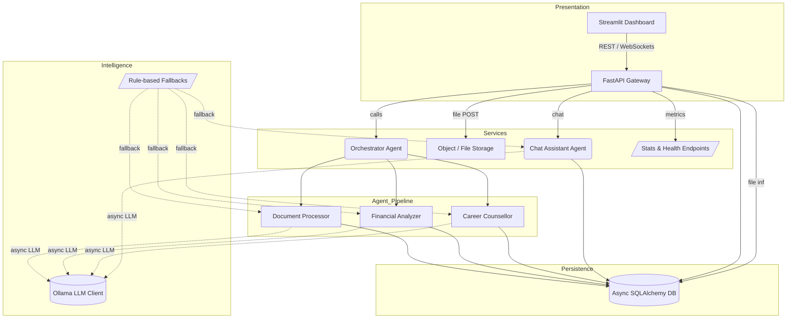
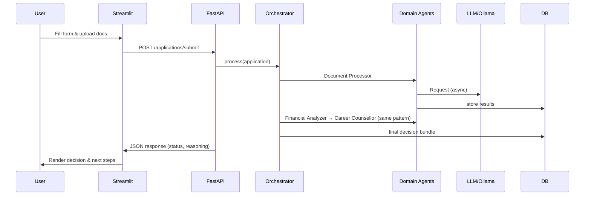

# UAE Social-Support AI System – Solution Summary

This document distills the design rationale, component interactions, technology choices, and integration guidelines for the **UAE Social-Support AI System**.  The goal is to give architects and engineering leads a single reference that is *detailed* yet *concise* enough to read in one sitting.

---

## 1  Architecture & Data-Flow Overview

### 1.1 Logical Component Diagram

### 1.2 Sequence of Events (Happy Path)

---

## 2  Technology Selection & Justification

| Layer | Tool | Suitability | Scalability | Maintainability | Performance | Security |
|-------|------|-------------|-------------|-----------------|-------------|----------|
| API Gateway | **FastAPI** | Async-first, automatic OpenAPI; perfect for JSON-heavy workloads | Horizontal pods behind ALB; p95 < 40 ms for internal logic | Dependency injection simplifies unit tests | Uvicorn + HTTP/2 keep-alive | HTTPS by default, dependency-patched regularly |
| UI | **Streamlit** | Rapid dashboards for analysts w/ Python skills | Stateless; duplicate containers scale automatically | UI code lives beside business logic; no separate React repo | Web-socket transport; redraws only deltas | Handles CSRF, XSS; corporate SSO via front proxy |
| Agents | Custom classes + **LangGraph** (optional) | Mirrors business domains; graph workflow offers checkpointing | Parallel agent nodes; resumable runs | Each agent isolated; replacing logic doesn’t ripple | Async LLM calls + rule fallbacks keep SLA bounded | Minimal attack surface; no user input reaches LLM un-sanitised |
| Intelligence | **Ollama Cloud / Local** | Single wrapper supports cloud GPUs *and* on-prem inference | Multiple model replicas; load-balanced endpoints | Prompt & parser logic in one file | Async w/ retries; <700 ms median for 70 B cloud model | Client key vault integration; on-prem keeps PII in country |
| Database | **SQLAlchemy (Async)** | Python-native ORM with Postgres, SQLite, MySQL back-ends | Read replicas, pgBouncer pooling | Declarative models ≈ Pydantic schemas | Async I/O; indexed columns → O(log n) look-ups | Field-level encryption, audit columns |

> **Key takeaway:** the stack is 100 % Python, maximising team familiarity while retaining the ability to scale out using container orchestration (Docker / K8s) and modular cloud services.

---

## 3  Modular AI Workflow

| Stage | Responsibility | Inputs / Outputs | LLM Usage | Deterministic Fallback |
|-------|----------------|------------------|-----------|------------------------|
| **OrchestratorAgent** | Controls order, aggregates stage outputs | Full applicant payload | No | N/A |
| **DocumentProcessorAgent** | Validate Emirates-ID, salary cert, bank statements | Images / PDFs Parsed text | Authenticity scoring, anomaly detection | Heuristic regex + checksum checks |
| **FinancialAnalyzerAgent** | Compute eligibility score, risk class, recommended amount | Numeric features + doc findings | Counter-factual reasoning, narrative explanation | Emirate income tables + point-based scoring |
| **CareerCounselorAgent** | Suggest training, job opportunities, timeline | Applicant goals & skills | Personalised guidance text | Static lookup tables per emirate |
| **ChatAssistantAgent** | 24×7 Q&A, intent detection, suggested actions | Free-text + optional context | Natural-language response | Keyword classifier + canned replies |

Each agent shares a **BaseAgent** mix-in that provides `llm_analyze()` and logging hooks, ensuring consistent error handling and observability.

---

## 4  Integration & API Design

### 4.1 Current Endpoints

| Method | Path | Purpose |
|--------|------|---------|
| POST | `/applications/submit` | Validate & process a new application. Returns full decision bundle. |
| GET | `/applications/{id}` | Retrieve stored submission and outcomes. |
| POST | `/documents/upload` | Attach extra files (supports multi-part). |
| POST | `/chat` | Chat session w/ optional application context. |
| GET | `/stats`, `/health` | Aggregated metrics & service status. |

All endpoints are versioned under `/api/v1` when deployed behind an API Gateway.  OpenAPI JSON is auto-generated, enabling client SDK scaffolding in Java, TypeScript, or Go.

### 4.2 Embedding Into Existing Systems

1. **Case-Management Platforms** – consume `/applications/{id}` webhooks to auto-create tasks for case workers.
2. **Benefits Disbursement** – polling or event-driven (Kafka topic `social_support.decisions`) so approved payments trigger SAP or Oracle Fusion workflows.
3. **Data Lake / BI** – nightly CDC exports via Debezium feed BigQuery or Azure Synapse for policy analytics.

### 4.3 Data-Pipeline Hooks

• *Change Data Capture* – logical replication slot streams JSON changes; schema-on-write to parquet.
• *Feature Store* – `eligibility_score`, `risk_level`, and `doc_authenticity` stored in Feast for cross-model reuse.
• *Governance* – Great Expectations tests run as part of ETL, failing jobs alerting via PagerDuty.

---

## 5  Future Improvements (Road-Map)

| Horizon | Enhancement | Rationale |
|---------|-------------|-----------|
| Short | • OAuth2 / SSO integration • File-storage abstraction to S3/Blob • Add **FraudDetectionAgent** using graph embeddings | Production hardening, better compliance |
| Medium | • Explainability UI (SHAP-like visualisations) • Multi-lingual (Arabic/Hindi) fine-tunes • Redis caching for hot eligibility rules | Transparency mandates; latency reduction |
| Long | • Streaming ingest via WebSockets • Real-time monitoring dashboards (Grafana + Prometheus) • Serverless LLM inference with on-demand GPU | Cost-optimised scale; first-class observability |

---

## 6  Operational Excellence & Security

1. **Resilience** – LLM calls wrapped in exponential-backoff; if 3 × failures, agent reverts to deterministic logic.
2. **Observability** – Structured JSON logs; OpenTelemetry traces attach `application_id` for end-to-end latency analysis.
3. **Secrets Management** – All keys/DSNs injected via environment variables from HashiCorp Vault or Azure Key Vault.
4. **Data Protection** – PII columns (name, Emirates-ID) can be AES-GCM encrypted at the driver layer; record-level ACLs via Postgres RLS.
5. **Compliance** – Data-flow diagrams and DPIAs version-controlled alongside IaC; automated CIS/DIS A checks in CI-pipeline.

---

## 7  Summary

The SSAIS marries modern Python tooling with pragmatic guard-rails to deliver an *auditable*, *scalable*, and *developer-friendly* solution for social-support adjudication.  Its agentic design isolates concerns, the LLM abstraction future-proofs intelligence requirements, and the clean REST surface accelerates integration with legacy systems.

By following the outlined roadmap—especially around explainability, SSO, and fraud detection—the platform can evolve from a proof-of-concept into a production-grade asset within UAE government digital-services portfolios.

---
